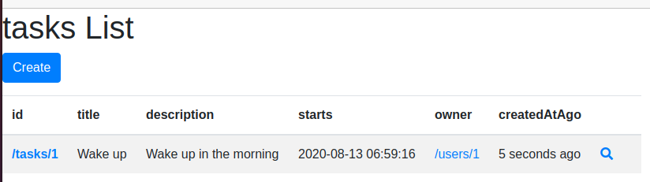
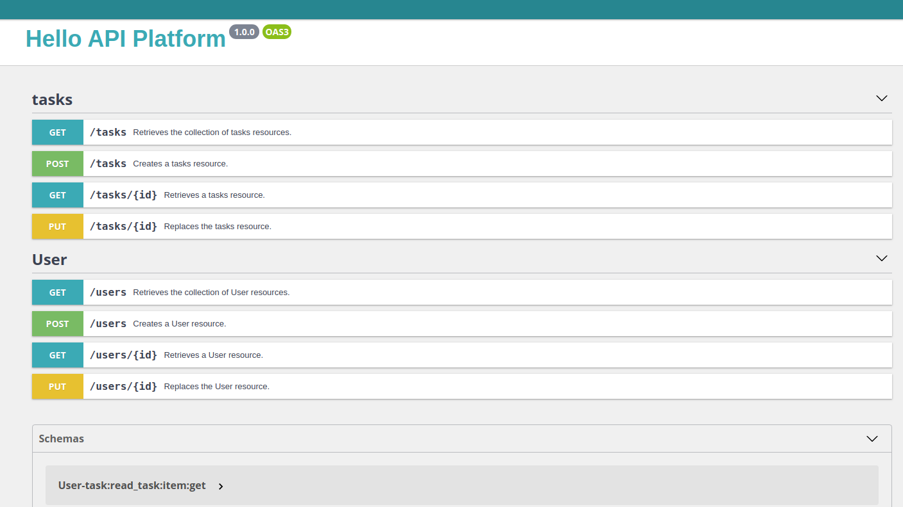
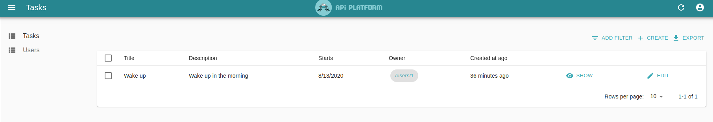

# Simple REST API tech assessment.

## Goal is to implement simple REST api to manage tasks creation / vizualization (TODO list).

For this task I selected API Platform application which works together with Symfony and has dockerized structure out of the box.

Api platform utilize Symfony entities annotations for managing API resources so it is pretty simple to set up basic API with plenty of control over it.

### Resources I found and I would follow:
- https://api-platform.com/

## How application looks like:




### Requirements of the assessment:
- Make simple REST API
- Pay attention to TDD, DDD, Event-driven Applications and Containers

### Technologies used in the assessment
- Symfony 5
- Docker
- Docker Compose
- PHP 7.3.10
- API Platform
- React

### Prerequisites
Docker.io and docker-compose must be installed in the system in order to be able to use the app.
OS Linux

## How to setup the application:
```bash
git clone git@github.com:belushkin/todo_list.git
cd todo_list;
docker-compose build
docker-compose up -d
docker-compose exec php bin/console doctrine:fixtures:load
```

### URLs of the running app
- https://localhost - Welcome page
- https://localhost:8443/ - API page
- https://localhost:444/#/tasks - Admin page
- https://localhost/tasks/ - TODO list visualization page (pay attention to last /)

## Contributors
@belushkin

## License
MIT License
